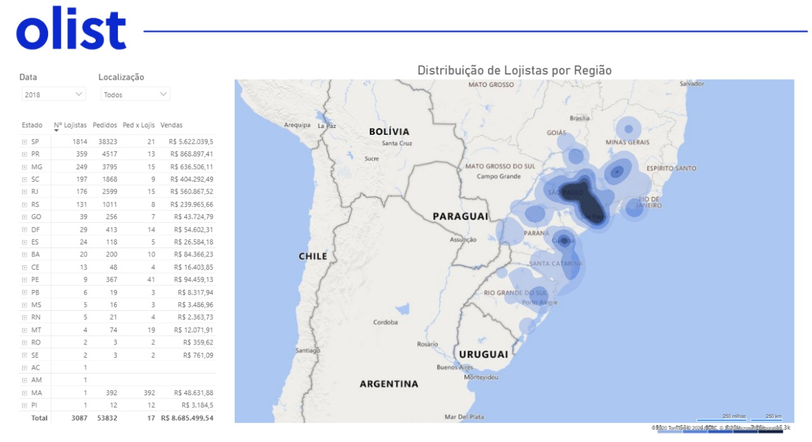
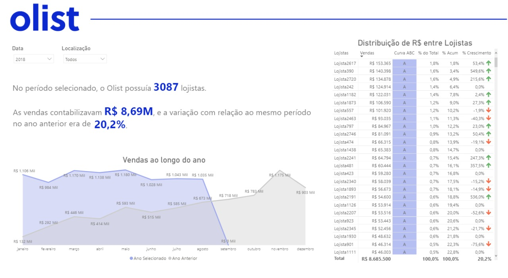
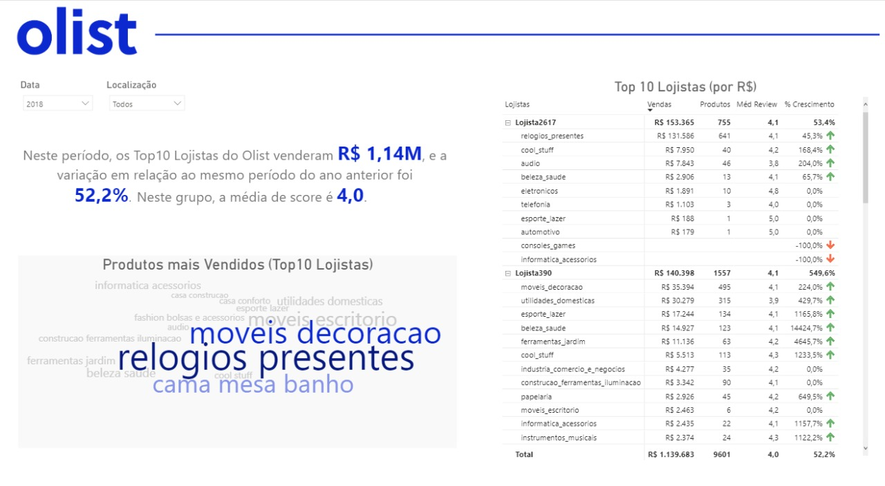

# Teste prático (work-at-olist-data)

Esta repositório traz uma abordagem de análise de dados sobre datasets públicos do Olist. A apresentação desta abordagem conta com uma **análise exploratória dos dados utilizando Pandas Profiling, além de 3 dashboards construídas utilizando Power BI**. 

Os arquivos de análise se encontram na pasta "analise".

## Abordagem

Para analisar os dados disponibilizados, as perguntas que me propus a responder foram:

1. Como a receita está distribuída?
2. Quem são os principais lojistas? O que eles vendem?  

Este README contém um breve resumo. O processo completo, assim como os resultados encontrados, estão descritos no relatório elaborado para entrega.

Dicionário de dados: https://github.com/anneglienke/work-at-olist-data/blob/master/analise/dicionario_dados.md

## Estratégia de limpeza e tratamento

1. Análise exploratória dos datasets (Google Colab - Python): https://colab.research.google.com/drive/1J7PyXbgIKoiL_0h1GcV1H0OZMM9YtQt8?usp=sharing. O Jupyter Notebook também está disponível na pasta "analise" do repositório. 
2. Upload dos datasets no Power BI.
3. Alteração de tipos e formatos de dados (codificação, latitude/longitude, valores, datas) para se adequarem aos padrões do Power BI e criação de coluna para transformação da coluna `seller_id` em nomes mais "amigáveis" esteticamente para os dashes.
4. Relacionamento entre tabelas no Power BI.
5. Criação de métricas para verificação de valores e construção dos gráficos e tabelas.
6. Verificação de hipóteses (Google Colab - Python): https://colab.research.google.com/drive/1J7PyXbgIKoiL_0h1GcV1H0OZMM9YtQt8?usp=sharing. O Jupyter Notebook também está disponível na pasta "analise" do repositório. 

## Bases utilizadas

### Datasets Olist
- olist_geolocation_dataset
- olist_order_items_dataset
- olist_payments_dataset
- olist_order_reviews_dataset
- olist_products_dataset
- olist_sellers_dataset

### Outros Datasets
- Sintegra PR - Contribuintes Ativos no ICMS
- Receita Federal (consultas via API)
